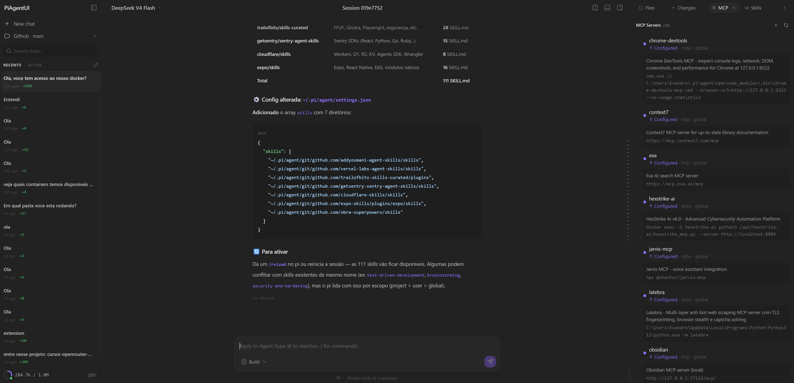
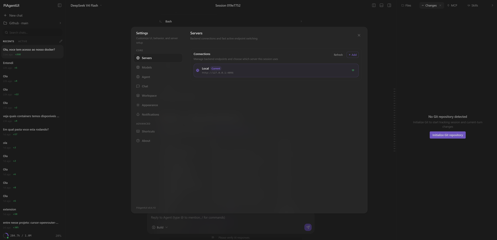
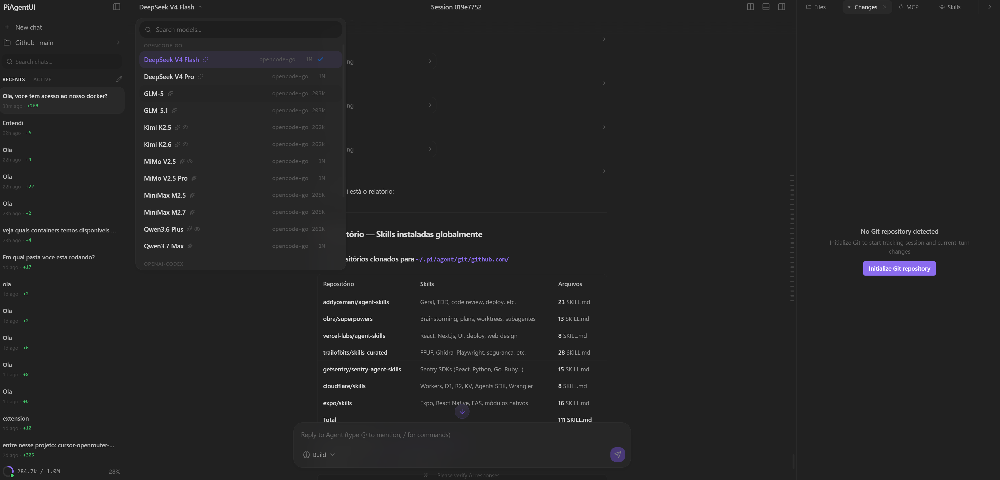

<p align="center">
  
</p>

# PiAgentUI

[English (US)](./README.md) | [Português (BR)](./README.pt-BR.md) | **Español** | [日本語](./README.ja.md)

> Esta traducción puede quedar por detrás de la versión de referencia, que es el [README principal](./README.md). Repositorio: https://github.com/evandrodevbr/PiAgentUI

PiAgentUI es una interfaz moderna web y de escritorio para **Pi Agent**. No es solo una capa visual de chat: el objetivo es convertirse en una aplicación completa de agentes, en la misma categoría de producto que Codex, Claude Desktop y otros entornos de desarrollo agent-first.

PiAgentUI trata el runtime real de Pi como la fuente de verdad. Sesiones, metadatos de modelos, uso de contexto, tool calls, skills, configuración MCP y slash commands vienen de Pi siempre que sea posible, en lugar de recrearse como estado falso de interfaz.

> **Estado del proyecto:** desarrollo local activo. Algunas áreas ya son cercanas a producto, mientras otras siguen cambiando rápidamente.

## Demostración del software

Estas capturas muestran la experiencia actual de PiAgentUI: un workspace oscuro y enfocado para agentes, con sesiones reales de Pi, selección de modelos, metadatos MCP, settings, chat con herramientas y paneles laterales.







## Qué hace PiAgentUI hoy

- **Chat con streaming** — salida en vivo por SSE, reconciliación estable de mensajes, markdown, resaltado de código, partes de razonamiento y tarjetas de herramientas.
- **Sesiones reales de Pi** — lista de sesiones, enrutamiento a la sesión activa, historial seguro tras reinicio, títulos derivados y envío a la sesión seleccionada.
- **Salida de herramientas en tarjetas** — tool calls/results quedan anexados a los mensajes del asistente, sin filtrarse como texto normal en el chat.
- **Uso real de contexto** — el uso de contexto viene del runtime de Pi cuando está disponible; el contexto desconocido/compactado se muestra de forma segura en lugar de `NaN`.
- **Metadatos de modelos** — la identidad de provider/modelo viene de Pi; el catálogo local de OpenRouter se usa solo como enriquecimiento de detalles.
- **Panel de Skills** — las skills reales se leen del prompt efectivo de Pi y se agrupan por origen: global, project, package y other.
- **Panel MCP** — lee servidores MCP configurados en archivos locales/globales y muestra transporte, comando, URL, lifecycle, direct tools y origen.
- **Slash commands de Pi** — `/api/commands/list` expone comandos built-in de Pi y comandos dinámicos de extensiones, prompts y skills.
- **Adjuntos multimodales** — soporte visual para archivos/imágenes/PDF/audio/video según las capacidades del modelo seleccionado.
- **Terminal y archivos** — terminal integrado, explorador de archivos, syntax highlighting, componentes de diff e integración de escritorio con Tauri.
- **UI keyboard-first** — command palette, atajos configurables, split panes, selector de modelo, navegación por proyecto/sesión y layouts responsivos.

## Dirección del producto

PiAgentUI está evolucionando hacia una aplicación completa de agentes:

1. **Acciones visuales para todos los comandos de Pi** — los slash commands siguen disponibles, pero las acciones frecuentes deben convertirse en botones, menús, diálogos o paneles.
2. **Entrada por voz y transcripción en tiempo real** — grabación de micrófono, deltas parciales, inserción de la transcripción final en el composer y configuración de proveedores STT OpenAI-compatible.
3. **Integración MCP más profunda** — más allá de metadatos: conectar, autenticar, inspeccionar herramientas y ejecutar workflows MCP desde la UI.
4. **Control completo de sesiones** — fork, clone, navegación en árbol, import/export/share, branch summaries y gestión de contexto como flujos nativos.
5. **Experiencia de escritorio completa** — app Tauri pulida con descubrimiento local de runtime, settings seguros, notificaciones y controles ricos de workspace.

## Roadmap de audio y transcripción

PiAgentUI ya acepta adjuntos de audio cuando el modelo seleccionado declara soporte de entrada de audio. El sistema de voz planeado añade speech-to-text en vivo directamente en el composer.

Arquitectura recomendada:

- **Proveedor realtime por defecto:** OpenAI Realtime Transcription con `gpt-realtime-whisper` para transcripción parcial de baja latencia.
- **Fallback por archivo:** OpenAI Audio Transcriptions con `gpt-4o-transcribe`, `gpt-4o-mini-transcribe` o `whisper-1`.
- **Proveedores personalizados:** APIs STT OpenAI-compatible configurables por el usuario, como proveedores que implementan `POST /v1/audio/transcriptions`.

UX planeada:

- botón de micrófono en el composer;
- estados de grabación y permisos;
- overlay de transcripción parcial;
- texto final insertado en el input;
- comportamiento configurable de append/replace;
- auto-send desactivado por defecto;
- manejo recuperable de errores de permisos, red y proveedor.

Ejemplo de configuración de proveedor:

```json
{
  "kind": "openai-compatible",
  "mode": "file",
  "baseUrl": "https://api.example.com/v1",
  "transcriptionEndpoint": "/audio/transcriptions",
  "transcriptionModel": "openai/whisper-large-v3",
  "language": "es"
}
```

El soporte realtime se trata como una capability separada, porque la compatibilidad HTTP con OpenAI no garantiza compatibilidad WebSocket.

## Arquitectura

```text
PiAgentUI
├─ Frontend React/Vite
│  ├─ chat, renderizado de mensajes, input, paneles y settings
│  ├─ stores locales para preferencias de UI
│  └─ clientes SSE/API para endpoints locales de PiAgentUI
├─ Backend como extensión Pi
│  └─ extensions/piagentui-server.ts
│     ├─ expone endpoints locales /api/*
│     ├─ conecta con runtime/sesiones/modelos de Pi
│     ├─ transmite eventos de Pi al navegador
│     └─ lee metadatos locales como MCP config y skills
└─ Runtime Pi Agent
   ├─ sesiones
   ├─ modelos/providers
   ├─ herramientas
   ├─ skills
   ├─ MCP
   └─ slash commands
```

La UI no debe inventar estado de runtime cuando Pi ya conoce la respuesta. PiAgentUI puede cachear y enriquecer datos para UX, pero Pi sigue siendo autoritativo para el comportamiento del agente.

## Stack técnico

| Área                | Stack                                         |
| ------------------- | --------------------------------------------- |
| UI                  | React 19, TypeScript                          |
| Build               | Vite 8                                        |
| Estilo              | Tailwind CSS v4 y design tokens del proyecto  |
| Escritorio          | Tauri 2                                       |
| Markdown            | Streamdown / pipeline de markdown             |
| Syntax highlighting | Shiki                                         |
| Terminal            | xterm.js                                      |
| Tests               | Vitest, Testing Library                       |
| Backend local       | Extensión Pi, Node HTTP server, WebSocket/SSE |

## Desarrollo local

Instalar dependencias:

```bash
npm install
```

Iniciar el frontend en modo dev:

```bash
npm run dev
```

Build:

```bash
npm run build
```

Tests:

```bash
npm run test:run
```

Type checks:

```bash
npm run typecheck
npm run typecheck:extensions
```

Validación completa:

```bash
npm run validate
```

## Runtime de la extensión Pi

PiAgentUI se registra como extensión Pi en `package.json`:

```json
{
  "pi": {
    "extensions": ["./extensions/piagentui-server.ts"]
  }
}
```

Cuando la extensión arranca, escribe metadatos de descubrimiento local en:

```text
~/.pi/agent/piagentui-port.json
```

La app web usa el puerto/token de ese archivo para hablar con el servidor local de la extensión. Algunos cambios de backend requieren reiniciar o recargar el proceso de la extensión Pi antes de verse en el navegador.

## Endpoints locales importantes

| Endpoint                         | Propósito                                                  |
| -------------------------------- | ---------------------------------------------------------- |
| `GET /api/models`                | Lista real de modelos Pi con capacidades normalizadas      |
| `GET /api/sessions`              | Lista de sesiones leída desde los archivos de sesión de Pi |
| `GET /api/sessions/:id/messages` | Historial normalizado para renderizado en la UI            |
| `GET /api/sessions/:id/context`  | Uso de contexto runtime para la sesión activa              |
| `POST /api/messages/send`        | Envía un mensaje a la sesión Pi solicitada                 |
| `GET /api/skills`                | Skills efectivas de Pi agrupadas por origen                |
| `GET /api/mcp/status`            | Metadatos de servidores MCP configurados                   |
| `GET /api/commands/list`         | Slash commands built-in y dinámicos de Pi                  |
| `GET /global/event`              | Stream SSE de eventos del backend PiAgentUI                |

## Principios de desarrollo

- Preferir datos reales del runtime Pi en vez de estado falso solo de UI.
- Mantener OpenRouter como enriquecimiento de catálogo, nunca como sustituto de la identidad provider/modelo de Pi.
- Tratar valores runtime desconocidos explícitamente.
- Escribir tests antes de cambios de comportamiento siempre que sea posible.
- Mantener tool results dentro de tarjetas de herramienta.
- Seguir el sistema visual existente: tema, movimiento, espaciado y patrones de paneles.
- Separar claramente lo implementado del roadmap.

## Notas del repositorio

El proyecto todavía contiene nombres heredados de la base original OpenCodeUI en algunos puntos, incluyendo metadatos del paquete y documentación antigua. La dirección actual es PiAgentUI-first, y una limpieza futura debe migrar esos nombres sin romper los workflows locales.

## Licencia

Este repositorio sigue la licencia declarada en `package.json`: `GPL-3.0-only`.
